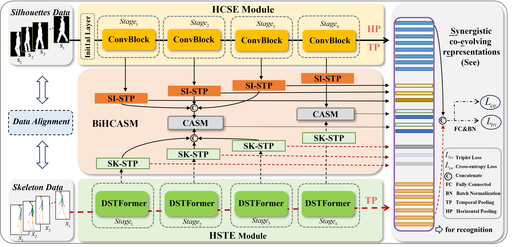

# SeeGait: Synergistic Co-evolving Representations for Multimodal Gait Recognition via Hierarchical Multi-Stage Fusion

This repository contains the code for **SeeGait**, a multimodal gait recognition framework that learns robust identity representations by enabling **skeleton** and **silhouette** modalities to interact, guide, and refine each other in a hierarchical multi-stage manner.

## News

(2026.03) Our paper has been accepted to IEEE Transactions on Information Forensics and Security (TIFS).

## Pipeline


## Overview

Gait recognition is a promising biometric technique for long-distance and non-contact person identification. However, its performance is often affected by challenging covariates such as **clothing changes**, **carrying conditions**, and **viewpoint variations**. Existing methods usually rely on a single modality or adopt shallow fusion strategies, which cannot fully exploit the complementarity between appearance cues and structural motion cues.

To address this issue, we propose **SeeGait**, a novel multimodal framework built upon the **Synergistic Co-evolving Representations (See)** principle. Instead of treating modalities as static inputs, SeeGait allows them to progressively interact and co-evolve across multiple semantic stages, leading to a more unified and discriminative gait representation.

## Data Preparation

Please preprocess your multimodal gait data before training.

Typical input modalities include:

- **Silhouette sequences**
- **Skeleton sequences**

You may organize the dataset into `.pkl` files following the [OpenGait](https://github.com/ShiqiYu/OpenGait)-style  data format.

## Training

Run the following command for training:

```bash
CUDA_VISIBLE_DEVICES=0,1,2,3 python -m torch.distributed.launch --master_port=29500 --nproc_per_node=4 "./opengait/main.py" --cfgs "./configs/SeeGait/Seegait_for_sustech1k.yaml"  --phase train --log_to_file
```

## Testing

Run the following command for evaluation:

```bash
CUDA_VISIBLE_DEVICES=0,1,2,3 python -m torch.distributed.launch --master_port=29500 --nproc_per_node=4 "./opengait/main.py" --cfgs "./configs/SeeGait/Seegait_for_sustech1k.yaml"  --phase test --log_to_file
```

## Citation

If this repository is helpful for your research, please consider citing our paper:

```
@article{seegait2025,
  title={SeeGait: Synergistic Co-evolving Representations for Multimodal Gait Recognition via Hierarchical Multi-Stage Fusion},
  author={Author1 and Author2 and Author3 and Author4},
  journal={IEEE Transactions on Information Forensics and Security},
  note={Accepted for publication, full citation information will be updated soon},
  year={2025}
}
```

## Acknowledgements

Here are some great resources we benefit from:

- The codebase is based on [OpenGait](https://github.com/ShiqiYu/OpenGait).
- Our skeleton data preprocessing method benefits from [FastPoseGait](https://github.com/BNU-IVC/FastPoseGait).
- We sincerely thank the authors of previous gait recognition repositories and benchmarks for making their code and datasets publicly available.

## Contact

For questions or collaborations, please contact the author:

**Hanyue Du** 

Email: [duhanyue349@163.com](mailto:duhanyue349@163.com)
